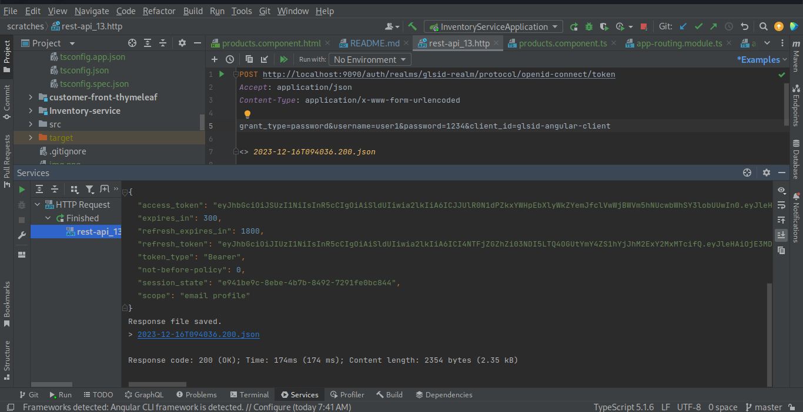

--------
 
 
 
 
 
 
 
 
 
<h2>On va creer le client pour notre application angular</h2> 
 
 
 
 

pour test votre client : 
 

POST http://localhost:9090/auth/realms/glsid-realm/protocol/openid-connect/token
Accept: application/json
Content-Type: application/x-www-form-urlencoded

grant_type=password&username=user1&password=1234&client_id=glsid-angular-client

 
 

apres que vous securise /products avec les guarde, et vous authentifier vous allez avoir la liste des produits

 
 
